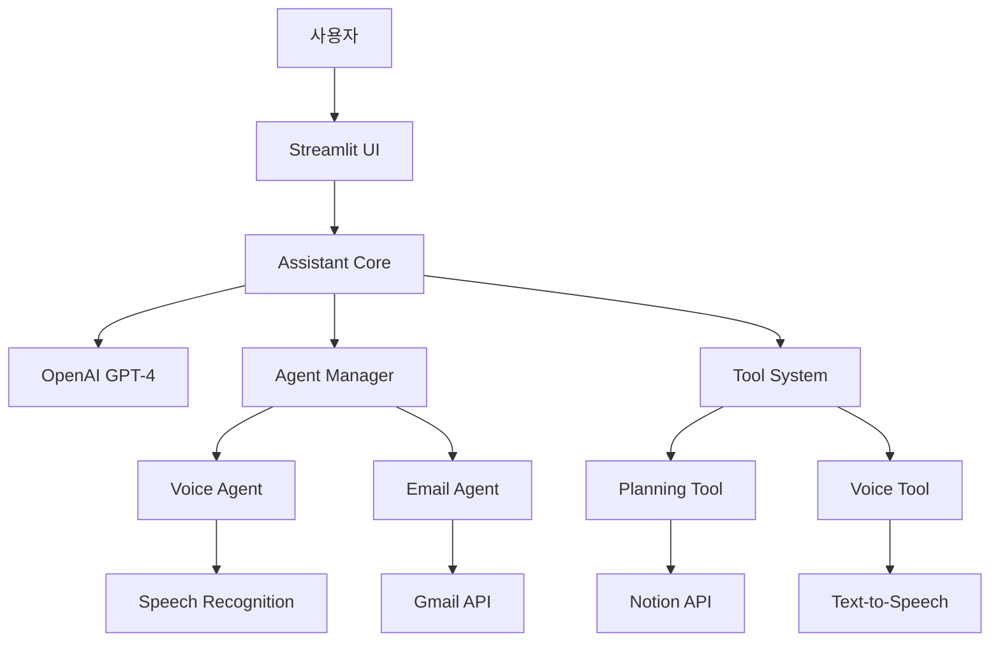

# My AI Agent 🤖

> 멀티 에이전트 기반 AI 자동화 시스템

[](https://python.org)
[](https://streamlit.io)
[](https://openai.com)
[](LICENSE)
[](#테스트)
[](#테스트-커버리지)
[](https://github.com/psf/black)

## 📋 목차
- [프로젝트 개요](#프로젝트-개요)
- [주요 기능](#주요-기능)
- [시스템 아키텍처](#시스템-아키텍처)
- [설치 및 설정](#설치-및-설정)
- [사용법](#사용법)
- [모듈 구조](#모듈-구조)
- [테스트](#테스트)
- [개발 가이드](#개발-가이드)
- [API 문서](#api-문서)
- [문제 해결](#문제-해결)
- [기여하기](#기여하기)
- [라이선스](#라이선스)

## 🎯 프로젝트 개요

My AI Agent는 OpenAI GPT-4를 기반으로 한 지능형 멀티 에이전트 시스템입니다. 음성 인식, 이메일 처리, 기획서 작성, 문서 관리 등 다양한 업무를 자동화하여 사용자의 생산성을 극대화합니다.

### 🌟 주요 특징
- **멀티 에이전트 아키텍처**: 각 기능별로 전문화된 에이전트가 협업
- **음성 인터페이스**: 실시간 음성 인식 및 음성 응답 지원
- **문서 자동화**: Notion과 연동한 기획서 및 문서 자동 생성
- **이메일 통합**: Gmail과 연동한 이메일 자동 처리
- **확장 가능한 구조**: 플러그인 형태의 도구 시스템

## 🚀 주요 기능

### 🎤 음성 에이전트 (Voice Agent)
- 실시간 음성 인식 (STT)
- 자연어 음성 합성 (TTS)
- 연속 음성 대화 지원
- 다국어 음성 처리

### 📧 이메일 에이전트 (Email Agent)
- Gmail API 연동
- 이메일 자동 분류 및 처리
- 스마트 이메일 응답 생성
- 이메일 요약 및 중요도 분석

### 📝 기획 도구 (Planning Tool)
- AI 기반 기획서 자동 생성
- 다중 페르소나 협업 시뮬레이션
- Notion 문서 자동 업로드
- 프로젝트 계획 및 관리

### 🔧 음성 도구 (Voice Tool)
- 고품질 음성 합성
- 실시간 음성 인식
- 음성 명령 처리
- 오디오 파일 처리

## 🏗️ 시스템 아키텍처



### 핵심 구성 요소

| 구성 요소 | 설명 | 위치 |
|-----------|------|------|
| **Frontend** | Streamlit 기반 웹 인터페이스 | `app.py` |
| **Core System** | LLM 통신 및 도구 관리 | `assistant_core.py` |
| **Agent System** | 멀티 에이전트 관리 | `agents/` |
| **Tool System** | 확장 가능한 도구 모듈 | `tools/` |
| **UI Components** | 재사용 가능한 UI 컴포넌트 | `ui_components/` |
| **Configuration** | 환경 설정 및 로깅 | `config.py`, `logging_config.py` |

## ⚙️ 설치 및 설정

### 시스템 요구사항
- Python 3.8 이상
- Windows 10/11 (macOS, Linux 지원 예정)
- 최소 4GB RAM
- 인터넷 연결 (API 호출용)

### 1. 프로젝트 클론
```bash
git clone https://github.com/your-username/my-ai-agent.git
cd my-ai-agent
```

### 2. 가상환경 설정
```bash
python -m venv venv
venv\Scripts\activate  # Windows
# source venv/bin/activate  # macOS/Linux
```

### 3. 의존성 설치
```bash
pip install -r requirements.txt
```

### 4. 환경 변수 설정
`.env` 파일을 생성하고 다음 내용을 추가:

```env
# OpenAI API 설정
OPENAI_API_KEY=your_openai_api_key_here
DEFAULT_MODEL=gpt-4o
MAX_TOKENS=2000

# Notion API 설정 (선택사항)
NOTION_API_KEY=your_notion_api_key_here
NOTION_PARENT_PAGE_ID=your_notion_page_id_here

# Gmail API 설정 (선택사항)
GMAIL_ADDRESS=your_gmail_address_here
GMAIL_APP_PASSWORD=your_gmail_app_password_here

# 애플리케이션 설정
ENVIRONMENT=development
LOG_LEVEL=INFO
LOG_DIR=logs
```

### 5. 애플리케이션 실행
```bash
streamlit run app.py
```

## 📖 사용법

### 기본 사용법
1. 웹 브라우저에서 `http://localhost:8501` 접속
2. 음성 또는 텍스트로 질문 입력
3. AI 에이전트가 적절한 도구를 선택하여 작업 수행
4. 결과를 텍스트와 음성으로 확인

### 음성 사용법
- **음성 질문**: "음성 질문" 버튼을 클릭하고 마이크에 말하기
- **연속 음성 인식**: 토글 버튼을 켜서 지속적인 음성 인식 활성화
- **음성 응답**: 간결한 답변이 자동으로 음성으로 재생

### 기획서 작성
```
"새로운 모바일 게임 개발 프로젝트의 기획서를 작성해주세요"
```

### 이메일 처리
```
"최근 중요한 이메일들을 요약해주세요"
```

## 📁 모듈 구조

```
my_ai_agent/
├── app.py                 # 메인 애플리케이션
├── assistant_core.py      # 핵심 로직
├── config.py             # 설정 관리
├── logging_config.py     # 로깅 설정
├── setup.py              # 패키지 설정
├── requirements.txt      # 의존성 목록
├── .env                  # 환경 변수
├── .gitignore           # Git 무시 파일
├── agents/              # 에이전트 시스템
│   ├── __init__.py
│   ├── agent_base.py
│   ├── agent_protocol.py
│   ├── agent_manager.py
│   ├── voice_agent.py
│   └── email_agent.py
├── tools/               # 도구 시스템
│   ├── planning_tool/
│   │   ├── __init__.py
│   │   ├── core.py
│   │   ├── prompts.py
│   │   └── configs.py
│   └── voice_tool/
│       ├── __init__.py
│       └── core.py
├── ui_components/       # UI 컴포넌트
│   ├── __init__.py
│   └── display_helpers.py
└── logs/               # 로그 파일
```

## 🧪 테스트

### 테스트 프레임워크

프로젝트는 `pytest`를 기반으로 한 포괄적인 테스트 프레임워크를 제공합니다.

#### 테스트 구조
```
tests/
├── unit/                   # 단위 테스트
│   ├── test_config.py     # 설정 모듈 테스트
│   └── test_agents.py     # 에이전트 테스트
├── integration/           # 통합 테스트
│   ├── test_basic_integration.py
│   └── test_voice_email_integration_pytest.py
└── __init__.py
```

#### 테스트 실행

**모든 테스트 실행:**
```bash
pytest tests/ -v
```

**단위 테스트만 실행:**
```bash
pytest tests/unit/ -v
```

**통합 테스트만 실행:**
```bash
pytest tests/integration/ -v
```

**특정 마크가 있는 테스트만 실행:**
```bash
# 통합 테스트만
pytest -m integration

# 느린 테스트 제외
pytest -m "not slow"
```

#### 테스트 커버리지

**커버리지 리포트 생성:**
```bash
pytest tests/ --cov=. --cov-report=html --cov-report=term-missing
```

**현재 테스트 현황:**
- ✅ **총 38개 테스트** 모두 통과
- 📊 **코드 커버리지**: 13% (향후 개선 예정)
- 🎯 **테스트 분류**:
  - 단위 테스트: 26개
  - 통합 테스트: 12개

#### 테스트 작성 가이드

**단위 테스트 예시:**
```python
import pytest
from unittest.mock import patch
from config import Config

class TestConfig:
    def test_config_initialization(self):
        """설정 초기화 테스트"""
        config = Config()
        assert config.DEFAULT_MODEL in ['gpt-4o', 'gpt-3.5-turbo']
```

**통합 테스트 예시:**
```python
@pytest.mark.integration
def test_agent_communication(self):
    """에이전트 간 통신 테스트"""
    voice_agent = VoiceAgent(agent_id="test_voice")
    email_agent = EmailAgent(agent_id="test_email")
    
    message = AgentMessage(
        sender_id=voice_agent.agent_id,
        receiver_id=email_agent.agent_id,
        message_type=MessageType.TASK_REQUEST,
        content="테스트 메시지"
    )
    
    assert message.sender_id == voice_agent.agent_id
```

### 코드 품질 도구

#### 자동 포맷팅
```bash
# Black을 사용한 코드 포맷팅
black .

# isort를 사용한 import 정렬
isort .
```

#### 린팅
```bash
# flake8을 사용한 코드 분석
flake8 . --max-line-length=88
```

#### 타입 체킹
```bash
# mypy를 사용한 타입 검사
mypy agents/ tools/ config.py
```

#### Pre-commit 훅 설정
```bash
# pre-commit 설치
pip install pre-commit

# 훅 설치
pre-commit install

# 모든 파일에 대해 실행
pre-commit run --all-files
```

## 🛠️ 개발 가이드

### 새로운 도구 추가

1. **도구 디렉토리 생성**
```bash
mkdir tools/my_new_tool
touch tools/my_new_tool/__init__.py
touch tools/my_new_tool/core.py
```

2. **도구 구현**
```python
# tools/my_new_tool/core.py
def my_function(param1: str, param2: int) -> dict:
    """도구 함수 구현"""
    return {"result": "success"}

TOOL_SCHEMAS = [
    {
        "type": "function",
        "function": {
            "name": "my_function",
            "description": "도구 설명",
            "parameters": {
                "type": "object",
                "properties": {
                    "param1": {"type": "string", "description": "매개변수 1"},
                    "param2": {"type": "integer", "description": "매개변수 2"}
                },
                "required": ["param1", "param2"]
            }
        }
    }
]

TOOL_MAP = {
    "my_function": my_function
}
```

3. **도구 등록**
`assistant_core.py`에서 새 도구를 import하고 등록

### 새로운 에이전트 추가

```python
# agents/my_new_agent.py
from .agent_base import BaseAgent

class MyNewAgent(BaseAgent):
    def __init__(self, agent_id: str):
        super().__init__(agent_id, "MyNewAgent")
    
    async def process_message(self, message):
        # 메시지 처리 로직
        pass
```

### 코딩 표준
- **PEP 8** 스타일 가이드 준수
- **Type Hints** 사용 권장
- **Docstring** 작성 (Google 스타일)
- **Error Handling** 적절한 예외 처리
- **Logging** 표준 로깅 시스템 활용

## 📚 API 문서

### 설정 API
```python
from config import config

# 환경 변수 접근
api_key = config.OPENAI_API_KEY
model = config.DEFAULT_MODEL
```

### 로깅 API
```python
from logging_config import get_logger

logger = get_logger(__name__)
logger.info("정보 메시지")
logger.error("오류 메시지")
```

### 에이전트 API
```python
from agents import AgentMessage, MessageType

message = AgentMessage(
    sender_id="user",
    receiver_id="voice_agent",
    message_type=MessageType.TASK,
    content="음성으로 응답해주세요"
)
```

## 🔧 문제 해결

### 일반적인 문제

#### 1. OpenAI API 키 오류
```
ValueError: 다음 환경 변수가 설정되지 않았습니다: OPENAI_API_KEY
```
**해결책**: `.env` 파일에 올바른 OpenAI API 키 설정

#### 2. 음성 인식 오류
```
OSError: [Errno -9999] Unanticipated host error
```
**해결책**: 마이크 권한 확인 및 PyAudio 재설치

#### 3. 모듈 임포트 오류
```
ModuleNotFoundError: No module named 'tools.planning_tool'
```
**해결책**: `__init__.py` 파일 확인 및 Python 경로 설정

### 로그 확인
```bash
# 최신 로그 파일 확인
tail -f logs/my_ai_agent_20240616.log
```

## 🤝 기여하기

### 기여 방법
1. Fork 프로젝트
2. Feature 브랜치 생성 (`git checkout -b feature/AmazingFeature`)
3. 변경사항 커밋 (`git commit -m 'Add some AmazingFeature'`)
4. Push to Branch (`git push origin feature/AmazingFeature`)
5. Pull Request 생성

### 개발 환경 설정
```bash
# 개발 의존성 설치
pip install -e ".[dev]"

# 코드 포맷팅
black .

# 린터 실행
flake8 .

# 테스트 실행
pytest
```

## 📄 라이선스

이 프로젝트는 MIT 라이선스 하에 배포됩니다. 자세한 내용은 [LICENSE](LICENSE) 파일을 참조하세요.

## 🙏 감사의 말

- [OpenAI](https://openai.com) - GPT-4 API 제공
- [Streamlit](https://streamlit.io) - 웹 UI 프레임워크
- [Google](https://developers.google.com) - Gmail API 및 Speech Recognition
- [Notion](https://notion.so) - 문서 관리 API

---

<div align="center">
Made with ❤️ by AI Agent Team
</div>
